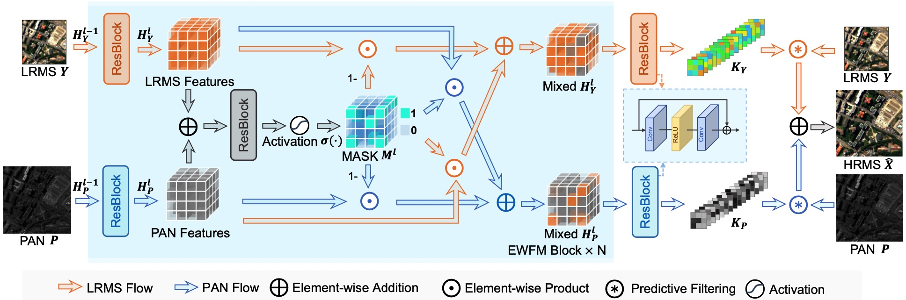

# ISPRS'25 Pansharpening via predictive filtering with element-wise feature mixing

This is the official pytorch implementation of [Pansharpening via predictive filtering with element-wise feature mixing](https://www.sciencedirect.com/science/article/abs/pii/S0924271624004064) (PreMix) (ISPRS 2025)


<hr />

> **Abstract:** *Pansharpening is a crucial technique in remote sensing for enhancing spatial resolution by fusing low spatial resolution multispectral (LRMS) images with high spatial panchromatic (PAN) images. Existing deep convolutional networks often face challenges in capturing fine details due to the homogeneous operation of convolutional kernels. In this paper, we propose a novel predictive filtering approach for pansharpening to mitigate spectral distortions and spatial degradations. By obtaining predictive filters through the fusion of LRMS and PAN and conducting filtering operations using unique kernels assigned to each pixel, our method reduces information loss significantly. To learn more effective kernels, we propose an effective fine-grained fusion method for LRMS and PAN features, namely element-wise feature mixing. Specifically, features of LRMS and PAN will be exchanged under the guidance of a learned mask. The value of the mask signifies the extent to which the element will be mixed. Extensive experimental results demonstrate that the proposed method achieves better performances than the state-of-the-art models with fewer parameters and lower computations. Visual comparisons indicate that our model pays more attention to details, which further confirms the effectiveness of the proposed fine-grained fusion method. Codes are available at https://github.com/yc-cui/PreMix.* 
<hr />


## Network Architecture




## Requirements

Install pytorch:

```python
conda install pytorch==2.1.2 torchvision==0.16.2 torchaudio==2.1.2 pytorch-cuda=11.8 -c pytorch -c nvidia
```

Install other required packages:

```python
pip install -r requirements.txt
```

## Training

We use [NBU_PansharpRSData](https://github.com/starboot/NBU_PansharpRSData) for training and testing.

One training example:
```python
python train.py --rgb_c 2,1,0 --ms_chans 4 --sensor GF --data_dir "~/data/3 Gaofen-1" --embed_dim 32 --kernel_size 3 --pf_kernel 3 --num_layers 1 --EWFM --activation tanh+relu
```


## Testing

The training process will obtain a checkpoint with best performence at validation set. One testing example:

```python
python test.py --rgb_c 2,1,0 --ms_chans 4 --sensor GF --data_dir "~/data/3 Gaofen-1" --embed_dim 32 --kernel_size 3 --pf_kernel 3 --num_layers 1 --EWFM --activation tanh+relu --ckpt log_m=PreMixHuge_s=GF_l=1_d=32_k=3_pfk=3_EWFM=True_a=tanh+relu/ep=279_PSNR=44.7997.ckpt
```


## Citation

If you find our work helpful, please cite us using the following BibTeX entry.
```
@article{CUI202522,
title = {Pansharpening via predictive filtering with element-wise feature mixing},
journal = {ISPRS Journal of Photogrammetry and Remote Sensing},
volume = {219},
pages = {22-37},
year = {2025},
issn = {0924-2716},
doi = {https://doi.org/10.1016/j.isprsjprs.2024.10.029},
url = {https://www.sciencedirect.com/science/article/pii/S0924271624004064},
author = {Yongchuan Cui and Peng Liu and Yan Ma and Lajiao Chen and Mengzhen Xu and Xingyan Guo},
keywords = {Pansharpening, Image fusion, Predictive filtering, Deep learning},
}
```

## Contact

Should you have any question, please contact cugcuiyc@cug.edu.cn